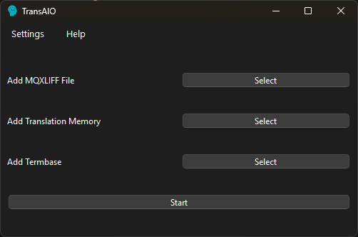

# TransAIO

**TransAIO** is a lightweight desktop application that automates and optimizes the translations by combining Machine Translation and/or LLM with Translation Memory and Termbase. It is designed with efficiency and simplicity in mind, offering multithreaded performance, contextual translation support, and a user-friendly PyQt6 interface.

 

---

## 🔧 Features

- **Context-Aware Translation** — Uses Translation Memory and Termbase (only with LLMs) for higher-quality results.
- **Live Translation Memory** — Each translation uses a seperate (temporary) Translation Memory together with the user selected Translation Memory for better translation consistency.
- **Fuzzy Match Support** - Segments that have 80%+ similarity are considered Fuzzy Match and sent to LLM for better translation consistency.
- **Multithreaded Translation Engine** — Translates large files quickly using concurrent threads.
- **Tag-Safe Translation** — Preserves inline formatting tags throughout the process.
- **MQXLIFF Compatible** — Handles `.mqxliff` files for seamless integration with memoQ.
- **Translation Logging** — Records each translation operation for audit and review (under _temp folder).

---

## 🚀 Getting Started

### Windows 

For Windows users, a pre-built executable is available. Download the latest release from the [Releases](https://github.com/sbkocoglu/trans-aio/releases/latest) page and run the program directly without needing to install Python or dependencies.

### Installing from Source

### Installation

- Python 3.13 or later

Clone the repository:

```bash
git clone https://github.com/sbkocoglu/trans-aio.git
cd source
```

Install dependencies (venv recommended):

```bash
pip install -r requirements.txt
```

Run the application:

```bash
python trans_aio.py
```

---

## 🧪 How to use
1. Open Settings menu from top-menu.
2. Enter your API keys and/or Ollama host URL and select the Ollama model you have installed.
3. Select how you want to translate and improve translations from Translation memory.
4. Select an MQXLIFF file.
5. (**Optional**) Select a Translation Memory and/or Termbase.
6. Click **Start** and select a destination to save the MQXLIFF file.
7. Wait for translation to end.
8. (**Optional**) Check **_temp** folder for details.

---

## 🐛 Known Issues

- **OpenAI API**: The translation is slow due to API limitations. Your API limitation is based on your [OpenAI tier](https://platform.openai.com/settings/organization/limits).
- Some rare tag formats may not be restored perfectly.
- If the system has limited threads, heavy jobs may cause UI freezing.
- Only **.mqxliff** and **.mqxlz** files are currently supported.

---

## 📌 To-Do

- Improve error handling 
- Machine Translation support for other MT engines.
- Additional support for other LLMs
- Further translation improvement (fuzzy matches where only the numbers are different, etc.)

---

## 📄 License
AGPL-3.0 license — see LICENSE for details.

---

## 👨‍💻 Author
Developed by Serkan Burak Koçoğlu